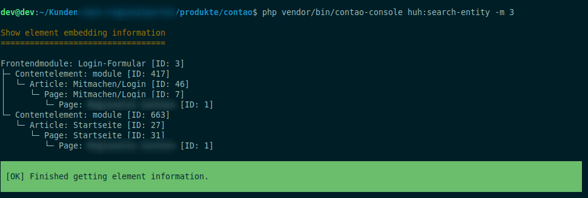

# Contao Search Entity Bundle

A helper to find where contao entities like frontend module or content elements are located. Currently this bundle contains a command which enabled the search of different entities type and outputs where they are located. Later a backend module is planned.



## Features

- search for following entities:
    - content elements
    - modules
    - article
    - page

## Usage

## Install 

Install with composer or contao manager

    composer require heimrichhannot/contao-search-entity-bundle

## Search command

Search is done with the `huh:search-entity` command.

Example:

    php vendor/bin/contao-console huh:search-entity -m 3

```
Usage:
  huh:search-entity [options]

Options:
  -c, --contentelement[=CONTENTELEMENT]  The id of an content element
  -m, --frontendmodule[=FRONTENDMODULE]  The id of an frontend module
```

## Information

### Search locations

A list about where is searched for entities (recursive):

Articles (`tl_article`)
- parent page

Blocks (`tl_block`)
- themes
- block frontend modules

Block modules (`tl_block_module`)
- parent block

Content elements (`tl_content`)
- parent table

Frontend modules (`tl_module`)
- module content elements
- layout
- block-modules
- insert_module inserttag within html frontend module
  
Layouts (`tl_layout`)
- parent theme

Pages (`tl_page`)
- parent page